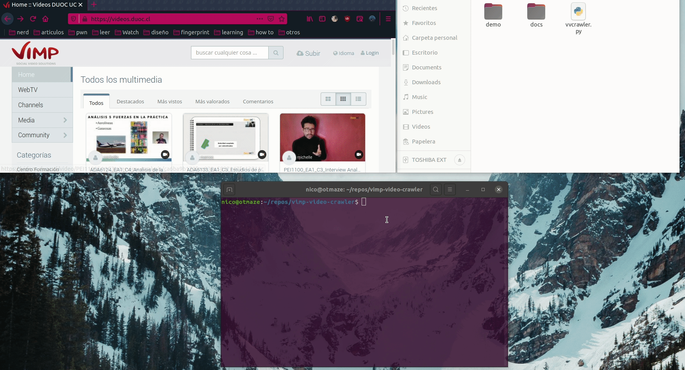

# VVCrawler 🕷

_Vimp Video Crawler es una herramienta de web crawler para la descarga de archivos de video dentro de páginas que ocupen servicios VIMP_

_Está basada en expresiones regulares_

## Caracteristicas

* Descarga videos en un rango de búsqueda

    ### Proximas caracteristicas y mejoras

    * Preguntar por directorio de descarga
    * Descarga individual
    * Búsqueda dentro del programa
    * Reintentar descargas en caso de error
    * Pulido 💎
    
## Dependencias

* [Urllib](https://docs.python.org/3/library/urllib.html) - Librería python3
* [Bs4 (BeatifulSoup4)](https://www.crummy.com/software/BeautifulSoup/bs4/doc/) - Librería python3
* [Colorama](https://github.com/tartley/colorama) - Librería python3

# Uso
_vvcrawler se ejecuta mediante linea de comandos_

_Al ejecutarlo se debe establecer un enlace de búsqueda dentro de VIMP_

_La herramienta analizará todas las páginas de la búsqueda y procederá a descargar los videos_

_Creará una carpeta por cada archivo con su respectivo nombre_

### Pasos a seguir
   1. Establecer enlace de búsqueda VIMP _(p.e. https://vimp.vv/search/title/Search/description/Search/tags/Search/type/all/search/basic/categoriesopt/0)_
   1. Esperar.. 🧉

## Licencia
[LICENCE](docs/LICENCE) - GNU General Public License v3.0 
